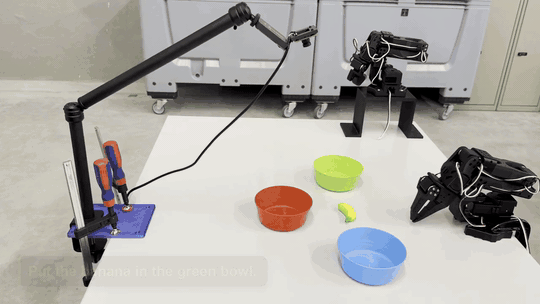

# Eval 1: Pick and Place into a Coloured Bowl

A banana sits in a fixed position. Three coloured bowls (blue, red, green) sit
in fixed positions. The policy picks up the banana and places it in the bowl
named by the prompt.

> *"Put the banana in the blue colored bowl."*

<div align="center">
<table>
  <tr>
    <td align="center"></td>
    <td align="center"></td>
    <td align="center"></td>
  </tr>
  <tr>
    <td align="center">"blue bowl"</td>
    <td align="center">"red bowl"</td>
    <td align="center">"green bowl"</td>
  </tr>
</table>
</div>

## Our approach

The bowls never move, so the only thing the policy has to get right is mapping
the **colour word in the prompt** to the correct bowl. A naive behaviour-cloning
policy tends to memorise one motion and ignore the word, so the approach has two
stages:

1. **Behaviour cloning.** We teleoperated roughly 40 demonstrations per colour
   (blue, red, green), each one a clean pick of the banana followed by a place
   into that colour's bowl.
2. **HG-DAgger corrections.** We then ran the behaviour-cloning policy, paused it
   wherever it drifted, and teleoperated the recovery. These correction episodes
   target exactly the positions where the policy failed.

The two sets are merged into one 153-episode dataset (118 clean demonstrations
plus 35 correction demonstrations) and **SmolVLA-450M** is fine tuned on it from
`lerobot/smolvla_base` for 25k steps with image augmentation. The deployed
checkpoint is **`HBOrtiz/so101_smolvla_eval1`** at step `025000`.

## What is on the Hugging Face Hub

| Repo | Type | Contents |
|---|---|---|
| [`so101_smolvla_eval1`](https://huggingface.co/HBOrtiz/so101_smolvla_eval1) | model | Deployed policy: 450M parameters, 25k steps, image augmentation, 5 intermediate checkpoints |
| [`so101_eval1`](https://huggingface.co/datasets/HBOrtiz/so101_eval1) | dataset | Merged behaviour-cloning plus DAgger training data: 153 episodes, 44.6k frames |

## Running a rollout

With the `lemonkey` conda environment active, the top-level wrapper
[`run_eval_1.sh`](../run_eval_1.sh) downloads the deployed checkpoint from the
Hub on first use and starts an interactive prompt loop:

```bash
./run_eval_1.sh                    # default = HF root (final 25k)
./run_eval_1.sh checkpoints/020000 # earlier intermediate
```

Each rollout captures the arm's starting pose, runs the policy for 40 s (press
the right-arrow key to end an episode early), then drives the arm back to the
starting pose for the next take.

## Structured evaluation

```bash
MODEL=v2 ./scripts/eval_checkpoint.sh             # 30 rollouts, random prompt-shuffle seed
MODEL=v2 ./scripts/eval_checkpoint.sh 025000 42   # 30 rollouts, fixed seed 42
./scripts/compare_evals.py                        # aggregate eval CSVs across sessions
```

The evaluation shuffles 30 prompts (5 verbatim training phrasings plus 5
paraphrases per colour), asks for a yes or no after each rollout, and writes a
CSV under `evals/`. `compare_evals.py` aggregates every CSV and prints per-colour
and per-prompt-type success rates.

## Other scripts

| Script | Purpose |
|---|---|
| `scripts/dagger_record.py` | HG-DAgger correction recorder (`SPACE` toggles teleop, `n` ends an episode early) |
| `scripts/rest_arms.py` | Release torques and manually home both arms |
| `scripts/brev_setup.sh` | Idempotent bootstrap for a fresh Brev training VM |
| `scripts/_archive/normalize_dagger_to_bc_schema.py` | One-shot: rewrite DAgger episodes into the BC schema so the two sets can be merged |

## Hardware

- **Robot**: SO-101 follower on `/dev/so101-follower`, leader on `/dev/so101-leader` (udev-stable symlinks), calibrated and in home pose.
- **Camera**: USB wrist camera at `/dev/video0`, 640x480 at 30 fps, the same physical mount used during training.
- **GPU**: any NVIDIA GPU with at least 6 GB of VRAM for inference (a GTX 1660 SUPER was enough); an H100 or RTX 6000 was used for training.

## Layout

```
eval_1/
├── README.md          this file
├── scripts/           all runnable scripts (tracked in git)
├── train/             model checkpoints (gitignored)
├── rollouts/          per-rollout dataset dumps (gitignored)
└── evals/             per-session evaluation CSVs (gitignored)
```

