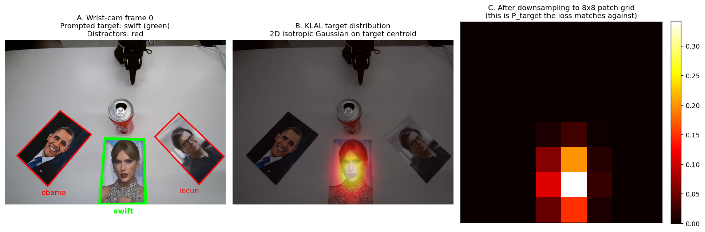
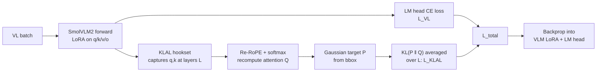

# Eval 3: Coke Can on a Celebrity Portrait

Place a Coke can on the printed portrait of the person named in the prompt.

> *"Put the Coke on Barack Obama."*

<div align="center">

</div>

This is the hardest of the three evaluations. The policy must connect a
**name** in the prompt to a **face** in the camera image, and do it even for
celebrities it was never trained on, using only the deployed VLA: no separate
face-recognition model, no external VLM call at inference.

- [Task](#task)
- [Why this is hard](#why-this-is-hard)
- [Our data approach: identity-preserving augmentation](#our-data-approach-identity-preserving-augmentation)
- [Our training approach: co-training + KLAL + LoRA](#our-training-approach-co-training--klal--lora)
- [Architecture choice: SmolVLA-450M](#architecture-choice-smolvla-450m)
- [Deployed models](#deployed-models)
- [Datasets](#datasets)
- [Running a rollout](#running-a-rollout)
- [Folder layout](#folder-layout)
- [References](#references)

---

## Task

- Three printed celebrity portraits are placed on the workspace.
- An empty Coke can sits in front of the robot.
- Prompt: `"Put the Coke on <celebrity name>."`
- 25 s per rollout. The policy places the can on the matching portrait.
- Three tiers of increasing difficulty:
  1. **In distribution**: the three celebrities seen at training (Taylor Swift, Barack Obama, Yann LeCun).
  2. **Held-out photos**: the same three people, different photos.
  3. **Out of distribution**: celebrities never seen at training.

**The inference constraint is the crux**: at demo time only the deployed VLA
may run. No YOLO, no face-ID network, no cloud VLM call. External models are
allowed at *training* time to label or synthesise data; only their effect on
the VLA weights is used.

---

## Why this is hard

Three failure modes block the straightforward solutions.

### 1. Behaviour cloning learns a positional shortcut

A behaviour-cloning policy trained on `(image, "Put the Coke on Obama", action)`
tuples will quickly minimise loss by ignoring the prompt and memorising the
arm's average trajectory toward whichever slot Obama was placed in most often
during training. This is the canonical [LIBERO-Plus shortcut-learning
pathology](https://arxiv.org/abs/2510.13626) (Liu et al., 2025) and the
[generalist-policy shortcut survey](https://arxiv.org/abs/2508.06426)
(Wang et al., 2025): when the prompt is correlated with a position in the
training distribution, the policy ignores the prompt at test time. At eval
day the celebrity arrangement is randomised, the shortcut breaks, and the
policy fails to chance.

### 2. A naive VLM does not know celebrity faces

The default fix would be to lean on the vision-language backbone's
pre-training: "the VLM has seen millions of celebrity images on the web; it
just needs a thin action head." Two problems:

- PaliGemma (used inside Pi0.5) is **DLP-filtered**: celebrity names and faces
  were stripped from the [WebLI](https://arxiv.org/abs/2209.06794) training
  corpus by Google's data-loss-prevention pipeline. Cross-checked by running
  zero-shot identification with PaliGemma on a curated 14-celebrity probe:
  **0/14** named correctly at training time.
- SmolVLM2 (used inside SmolVLA-450M) is trained on a smaller corpus
  (~1.1T tokens, [SmolVLM technical report](https://arxiv.org/abs/2504.05299))
  and has even weaker celebrity-face priors than PaliGemma.

So the celebrity knowledge has to be **installed into the policy weights at
fine-tuning time**, in a way the BC loss alone will not produce.

### 3. Hand-teleoperating enough variety is infeasible

For the policy to reliably pick up the can and place it on the correct face
regardless of which face is named or where it sits on the table, it has to
see a **lot** of demonstrations: many celebrities × many table layouts ×
many trajectories. A modest matrix (say 30 celebrities × 6 layouts × 50
demos each) is 9,000 episodes. At ~20 s per episode plus reset, that is
weeks of continuous teleoperation we did not have.

A recipe of "record 180 demos by hand, then train on those 180" hits the
shortcut from §1 immediately: there are not enough layouts in 180 demos to
break the position correlation. The data side of the problem is just as
load-bearing as the training side, and it needs its own solution.

---

## Our data approach: identity-preserving augmentation

> [!IMPORTANT]
> **Deep dive: [`eval_3/aug/README.md`](aug/README.md).** This section is
> the overview. The aug README walks through every stage of the pipeline
> (GroundingDINO + SAM 2 portrait detection, sub-pixel paper-quad refit,
> identity-preserving inpainting, KLAL + LoRA training modules) with the
> visual gates and design rationale. If you want to understand how the
> 9,216 IID variants are actually rendered, read it.

The dataset is the lever that turns the §3 problem from "weeks of
teleoperation" into "one weekend of teleoperation plus one GPU-week of
rendering". The recipe is:

1. **Teleop a small base set.** ~180 real episodes per dataset (cotrain
   and broad) of the Coke can placed on three printed portraits of Taylor
   Swift, Barack Obama, and Yann LeCun, across varied layouts, lighting, hand
   approaches, and slot orderings.
2. **Multiply each base episode by inpainting new celebrity faces onto the
   same printed portraits**, frame by frame, without touching the action
   trajectory or the rest of the scene. The arm motion, gripper timing,
   table layout, occluder geometry, and lighting are exactly as recorded;
   only the three faces change.
3. **Emit a vision-language grounding pair for every frame** of every
   augmented variant, linking each portrait's bounding box to the
   celebrity's name. These are the (image, text) pairs used by the
   co-training loss in [§Our training approach](#our-training-approach-co-training--klal--lora).

Two datasets come out of this, one for each eval-day regime:

|                          | **IID (toy)** | **OOD (broad)** |
|--------------------------|---|---|
| **HF dataset**           | [`so101_eval3_cotrain`](https://huggingface.co/datasets/HBOrtiz/so101_eval3_cotrain) | [`so101_eval3_broad`](https://huggingface.co/datasets/HBOrtiz/so101_eval3_broad) |
| **Celebrity bank**       | 3 (Swift, Obama, LeCun) | 192 (scraped + ArcFace-verified) |
| **Variant generation**   | **Exhaustive enumeration** of every (target, target photo, layout, distractor pair) tuple | **Random sampling**: per base teleop, draw 3 distinct celebs uniformly from the bank, repeat 54×|
| **Variants per dataset** | 3 × 8 × 6 × 64 = **9,216** | ~180 × 54 ≈ **9,662** |
| **+ base teleops**       | ~180                    | ~180 |
| **= total episodes**     | **9,394**               | **9,842** |
| **= total frames**       | **5.05 M**              | **5.29 M** |
| **What it teaches**      | Breaks the §1 positional shortcut by saturating every (layout × target × distractor) cell on the 3 known faces. | Forces the VLM backbone to generalise across 192 different celebrity faces, so eval-day faces it has never seen still ground correctly. |

The IID multiplication, written out:

$$
\underbrace{3}_{\text{target celeb}}
\times
\underbrace{8}_{\text{target photos per celeb}}
\times
\underbrace{6}_{\text{slot layouts (3!)}}
\times
\underbrace{8 \times 8}_{\text{distractor-photo combos}}
= 9{,}216 \text{ variants}
$$

No random sampling, no missed cells. Every (target celeb, target photo,
layout, distractor pair) tuple appears at least once in
`so101_eval3_cotrain`. The broad dataset cannot do this (full enumeration
at 192 celebs × 3 slots is too large to render in finite time), so it
trades exhaustiveness for face diversity.

Because the swap is identity-preserving (pixel-accurate face replacement
on the printed quads, with the gripper / can / hand never overdrawn), the
action labels stay valid in both cases.

The pipeline uses [GroundingDINO](https://arxiv.org/abs/2303.05499) for
open-vocabulary portrait detection, [SAM 2](https://arxiv.org/abs/2408.00714)
for per-frame mask propagation (so the gripper and can are preserved when
they cross a portrait), a sub-pixel paper-quad refit on Canny edges, and
Lanczos-warped alpha-feathered face composites. See
[`aug/README.md`](aug/README.md) for the full stage-by-stage architecture
and visual gates. [ArcFace](https://arxiv.org/abs/1801.07698) is used at
*training* time only, to verify that each variant's swapped face is still
recognisable as the labelled celebrity.

Dataset-verification tooling, which renders the bounding boxes and labels
back onto the videos to confirm correctness, lives in [`tools/`](tools/).

The augmentation pipeline ships visual gates after every stage. The two
most useful ones, both auto-generated by scripts under
[`aug/dbg/`](aug/dbg/), are:

<div align="center">

</div>

Per-frame portrait + occluder masks, produced by
[`aug/dbg/segmentation_video.py`](aug/dbg/segmentation_video.py): SAM 2
seeds each gripper / can / hand from frame 0 and propagates the masks
through the clip, so the inpainter knows which pixels of the printed
portrait to keep untouched.

<div align="center">

</div>

Side-by-side original (left) vs augmented variant (right), produced by
[`aug/dbg/compare_gif.py`](aug/dbg/compare_gif.py). The action trajectory,
table layout, lighting, and gripper motion are unchanged; only the three
printed portraits have been swapped.

> [!TIP]
> **Continue with [`eval_3/aug/README.md`](aug/README.md) →** for the rest
> of the visual gates (GroundingDINO + SAM 2 detection panel, Stage 3
> sub-pixel quad refit, Stage 4 step-by-step inpainting panel), the
> per-stage source files, and the KLAL + LoRA training-time modules that
> live alongside the augmentation code.

---

## Our training approach: co-training + KLAL + LoRA

With the dataset in hand, the training-side problem from §1 and §2 still
needs to be solved: how do we install celebrity knowledge into the policy
weights without overwriting the VLM's pre-training, and how do we make sure
the celebrity-name token in the prompt actually routes attention to the
right face in the image. The deployed solution combines three published
techniques into one fine-tuning run on SmolVLA-450M.

### Co-training (RT-2 §3.2)

We adopt the [RT-2 §3.2 co-fine-tuning recipe](https://arxiv.org/abs/2307.15818)
(Brohan et al., 2023): keep the VLM's web-scale knowledge alive by training
the action expert *alongside* a second loss stream that exercises the
vision-language backbone on (image, text) pairs. Pure sequential
fine-tuning (VLM first, then action) catastrophically forgets the prior;
mixed-batch fine-tuning preserves it.

We interleave at the step level:

- Every step where `step % (vl_ratio + 1) == 0`: a **vision-language batch**
  of (portrait image, location prompt, target answer) pairs, supervised with
  cross-entropy on SmolVLM2's LM head.
- Every other step: a **robot batch** of (overhead image, action prompt, target
  action) tuples, supervised with SmolVLA's flow-matching action loss.

Both losses share one AdamW optimiser; both gradients flow through the
SmolVLM2 backbone. The action expert only sees the robot gradient; the LM
head only sees the VL gradient. The VLM in the middle gets both.

The robot-to-VL ratio matters. The
[ObjectVLA paper](https://arxiv.org/abs/2502.11550) (Sun et al., 2025) reports
that bbox-grounded VL co-training at **10:1** robot:VL yields a +45 percentage
point lift on OOD generalisation. We tested 5:1 and 10:1 in parallel and
deployed the **5:1** ratio for the in-distribution model. The ObjectVLA
default 10:1 was retained for the broad (192-celebrity) variant.

### KLAL: KL Attention Loss for celebrity routing

Co-training alone is necessary but not sufficient. An attention-probe of the
v1 SmolVLA cotrain checkpoint at step 10k showed that even after VL
co-training the celebrity-name token in the prompt did not attend to the
correct portrait region in the image: the argmax attention head produced the
same top-image-patch regardless of which celebrity was named.

We added the **KL Attention Loss** from the WACV 2026 paper
[*Direct Visual Grounding by Directing Attention of Visual Tokens*](https://arxiv.org/abs/2511.12738)
(Wu et al., 2026). KLAL directly supervises the attention distribution from
the name token to the image patches, against a target distribution built from
the known portrait bounding box.

#### KLAL formulation

For each monitored transformer layer $\ell \in \mathcal{L}$ and each
name-token-to-image-patch attention row, the loss is the KL divergence between
the target distribution $P_\text{target}$ and the model's actual attention
$Q^{(\ell)}$, summed over $\mathcal{S}$ (the set of image-patch positions in
the prefix):

$$
\mathcal{L}_\text{KLAL} = \frac{1}{|\mathcal{L}|} \sum_{\ell \in \mathcal{L}} \mathrm{KL}\bigl( P_\text{target}(\mathcal{S}) \mathrel{\Vert} Q^{(\ell)}(\mathcal{S}) \bigr)
$$

where:

- $\mathcal{S}$ are the 256 image-patch positions (Pi0.5 / PaliGemma 16×16 grid;
  64 for SmolVLM2 8×8).
- $Q^{(\ell)}(\mathcal{S})$ is the model's actual softmax attention from name
  tokens to image patches at layer $\ell$, averaged across heads and across
  the name-token rows. The implementation hooks `q_proj` and `k_proj`,
  re-applies the model's own rotary positional embedding (cos / sin captured
  live from `text_model.rotary_emb`), and recomputes `softmax(QK^T * scaling)`.
  RoPE is required: SmolVLM2's real forward RoPEs $q, k$ before attention, so
  a no-RoPE recompute would supervise a content-only proxy decoupled from the
  attention the policy actually uses.
- $P_\text{target}(\mathcal{S})$ is a Gaussian-smoothed distribution over the
  patch grid, peaked at the prompted celebrity's portrait centroid. The
  target is normalised to sum to 1.
- We monitor mid-late VLM layers ([6, 10, 14, 17] for Gemma-2B in Pi0.5;
  [10, 12, 14] for SmolVLM2 in SmolVLA). Late layers carry the semantic
  binding; very-late layers (post-pooling) lose the spatial structure that
  the loss needs.

The three losses are applied on alternating steps under one shared
optimiser, not combined per step:

Let $r_{\text{vl}}$ denote the `vl_ratio` (the number of robot batches per
VL batch). Then a single step does:

$$
\mathcal{L}_\text{step} = \begin{cases}
\mathcal{L}_\text{VL} + \lambda_\text{KLAL} \cdot \mathcal{L}_\text{KLAL} & \text{if } \text{step} \bmod (r_{\text{vl}} + 1) = 0 \\
\mathcal{L}_\text{action} & \text{otherwise}
\end{cases}
$$

with $\lambda_\text{KLAL} = 1.0$ per the WACV 2026 paper's default. KLAL
fires only on VL steps because its gradient depends on knowing where the
prompted celebrity's portrait actually is (the bbox), which the VL stream
carries and the robot stream does not. Over a full pass through the data
the schedule averages out to the weighted sum
$\sim \mathcal{L}_\text{action} + (1 / r_{\text{vl}}) \cdot (\mathcal{L}_\text{VL} + \mathcal{L}_\text{KLAL})$.

#### One deviation from the paper

The WACV 2026 paper builds $P_\text{target}$ from the bbox's **centre line of
patches** (tuned for elongated RefCOCO objects). For a compact face bbox we
use a **2-D isotropic Gaussian on the bbox centroid** instead. See
[`scripts/smolvla_cotrain/klal_core.py`](scripts/smolvla_cotrain/klal_core.py)
function `gaussian_target_from_mask`.

<div align="center">

</div>

The three panels show the construction on a real overhead-cam frame from our
dataset: the prompted target bbox highlighted in green (A), the continuous
2D Gaussian centered on its centroid (B), and the same Gaussian
downsampled to SmolVLM2's 8x8 patch grid (C). Panel C is the
$P_\text{target}(\mathcal{S})$ that the KL term compares the model's
attention against.

#### Why KLAL works under SmolVLA's prefix-LM attention

SmolVLM2 (and PaliGemma) use a **prefix-LM full bidirectional attention** mask
inside the image tokens: every text token already has architectural access to
every image patch. KLAL is therefore shaping a working channel rather than
trying to create one from scratch. This is exactly the setting where the
WACV 2026 paper reports the largest gains.

### LoRA: parameter-efficient adaptation

The VLM body is large (450M for SmolVLA, 2B for Pi0.5). Full fine-tuning
risks catastrophic forgetting and is slow to converge under the multi-loss
objective above. We apply [LoRA](https://arxiv.org/abs/2106.09685)
(Hu et al., 2021) to the attention projections of the mid-late VLM layers,
so:

- The pre-trained VLM weights are **frozen**.
- A trainable low-rank delta is added on selected attention / MLP
  projections of mid-late VLM layers.
- The forward becomes $y = W_0 x + \frac{\alpha}{r} B A x$.
- At checkpoint time the LoRA delta is **merged into the base weights**, so
  the published policy loads as a vanilla policy with no extra inference
  dependency.

The two deployed variants use different LoRA hyperparameters:

| Variant | Target modules | Layers | rank $r$ | $\alpha$ | dropout |
|---|---|---|---|---|---|
| **SmolVLA cotrain** ([`lora_smolvla.py`](scripts/smolvla_cotrain/lora_smolvla.py)) | `q_proj, k_proj, v_proj, o_proj` (attention only) | $[9, 10, \ldots, 15]$ | 16 | 32 | 0 |
| **Pi0.5 cotrain** ([`scripts/brev/train_pi05.sh`](scripts/brev/train_pi05.sh) + [`scripts/pi05_vl_cotrain/precomputed/layer_rank.json`](scripts/pi05_vl_cotrain/precomputed/layer_rank.json)) | `q_proj, k_proj, v_proj, o_proj, gate_proj, up_proj, down_proj` (full Gemma block) | $[0, 1, \ldots, 17]$ all 18 layers, per-layer rank | 16 to 64 per layer (uniform fallback: 32) | 64 | 0.05 |

The Pi0.5 per-layer rank profile concentrates capacity in the
face-discrimination zone of PaliGemma's Gemma-2B tower
([`scripts/pi05_vl_cotrain/precomputed/layer_rank.json`](scripts/pi05_vl_cotrain/precomputed/layer_rank.json)):

- layers 0 to 4: $r = 16$ (preserve warm-PG WebLI prior)
- layers 5 to 7 and 13 to 14: $r = 32$ (default scaffold)
- layers 8 to 12: $r = 64$ (the BlindVLA mid-LM face-discrimination zone, roughly 50 to 67% LM depth)
- layers 15 to 17: $r = 48$ (top-LM name-token alignment, what the LM head reads)

Sum of ranks across the 18 layers is 704, averaging $r \approx 39$. If the
installed PEFT version cannot ingest per-layer ranks the launcher falls
back to a uniform $r = 32$ with a `[WARN]`.

LoRA also matters for KLAL: KLAL supervises the attention computed from
$q_\ell$, $k_\ell$ at layers $\ell \in \mathcal{L}$. If those projections
were frozen (as they are under SmolVLA's `train_expert_only=True` default),
KLAL would back-propagate into frozen weights and learn nothing. The
`LoRAConfig.layers` set must therefore be a superset of the KLAL-supervised
layers; this is the caller's responsibility (see the docstring note in
[`lora_smolvla.py`](scripts/smolvla_cotrain/lora_smolvla.py)).

### Putting it together

A single training step that runs at `step % 11 == 0` (a VL step under
$r_{\text{vl}} = 10$) executes the following:



A robot step (the other 10/11 of the schedule) runs SmolVLA's standard
flow-matching action loss with the action expert receiving gradient, the
VLM body frozen modulo the LoRA delta:


Both passes share one optimiser, so the LoRA delta accumulates gradient
from both losses. The action expert only sees the robot gradient; the LM
head only sees the VL gradient. The VLM body in the middle is what makes
the celebrity prior usable for action conditioning.

---

## Architecture choice: SmolVLA-450M

We considered three VLA backbones:

| Model | Params | VLM core | Action expert |
|---|---|---|---|
| **SmolVLA-450M** | 450 M | SmolVLM2 (~430 M) | flow-matching (~20 M) |
| Pi0.5 | 3.3 B | PaliGemma-2B | Gemma-300M |
| OpenVLA | 7 B | Prismatic-7B | discrete-token action head |

We deployed **SmolVLA-450M** ([Shukor et al., 2025, arXiv:2506.01844](https://arxiv.org/abs/2506.01844))
for three reasons:

1. **The course evaluation rewards the smallest model with a bonus**.
   SmolVLA-450M is the smallest publicly released VLA with a flow-matching
   action expert and is genuinely competitive.
2. **At least 6 GB VRAM at inference**, which lets us run the policy on a
   consumer laptop GPU during demo-day rollouts (no remote inference, no
   batching tricks).
3. **PaliGemma's DLP-filtered pre-training is a known liability for celebrity
   tasks** (see [§ Why this is hard](#why-this-is-hard)). SmolVLM2's smaller
   web corpus is *also* weak on celebrity faces, but we install the prior
   via co-training rather than relying on the backbone. The advantage of
   Pi0.5 (5× the VLM size) is partly nullified because we have to install
   the prior either way.

A Pi0.5 reference variant was trained
([`HBOrtiz/so101_pi05_eval3`](https://huggingface.co/HBOrtiz/so101_pi05_eval3))
via a PaliGemma VQA warm-start ([`scripts/warmstart/`](scripts/warmstart/))
plus a Pi0.5 LoRA fine-tune ([`scripts/brev/train_pi05.sh`](scripts/brev/train_pi05.sh))
and is published for reproducibility, but the two deployed eval-day policies
are both SmolVLA.

### Single-camera inference contract

The training data has three image streams (`camera1` overhead, `camera2` and
`reference`). At inference we feed only `camera1` and rely on SmolVLA's
`empty_cameras` config to zero-pad the unused slots:

- `so101_smolvla_eval3_cotrain`: `empty_cameras = 2`
- `so101_smolvla_eval3_broad`: `empty_cameras = 1`

This contract is enforced by the rollout scripts in
[`scripts/rollout/`](scripts/rollout/); the policies are not asked to run
inference on placeholder frames.

---

## Deployed models

| Model | Use | Recipe |
|---|---|---|
| [`HBOrtiz/so101_smolvla_eval3_cotrain`](https://huggingface.co/HBOrtiz/so101_smolvla_eval3_cotrain) | in-distribution celebrities | SmolVLA-450M, robot + VL co-training at 5:1, single-camera contract. Checkpoints nested under `step_NNNNNN/`. |
| [`HBOrtiz/so101_smolvla_eval3_broad`](https://huggingface.co/HBOrtiz/so101_smolvla_eval3_broad) | broad and out-of-distribution | SmolVLA-450M, robot + VL co-training on the 192-celebrity dataset, 10:1 ratio. The 25k checkpoint is deployed at the repo root. |

Both are fine-tuned from
[`lerobot/smolvla_base`](https://huggingface.co/lerobot/smolvla_base): the
SmolVLM2 vision-language backbone is kept, and the action expert plus
LoRA-on-q/k/v/o adapters are trained.

Three additional reference variants are published under the same HF org:

| Repo | Recipe |
|---|---|
| [`HBOrtiz/so101_smolvla_eval3_cotrain_10to1`](https://huggingface.co/HBOrtiz/so101_smolvla_eval3_cotrain_10to1) | Same recipe at the ObjectVLA default 10:1 ratio. |
| [`HBOrtiz/so101_smolvla_eval3_cotrain_klal`](https://huggingface.co/HBOrtiz/so101_smolvla_eval3_cotrain_klal) | Adds KLAL attention supervision on the VL stream. |
| [`HBOrtiz/so101_pi05_eval3`](https://huggingface.co/HBOrtiz/so101_pi05_eval3) | Pi0.5 (PaliGemma-2B + Gemma-300M action expert) via LoRA from the `paligemma_vqa_warm` backbone init. |

---

## Datasets

| Dataset | Role |
|---|---|
| [`HBOrtiz/so101_eval3_cotrain`](https://huggingface.co/datasets/HBOrtiz/so101_eval3_cotrain) | Robot stream: 9,394 episodes (real base teleops + augmented variants) of the can placed on Swift, Obama, and LeCun portraits. |
| [`HBOrtiz/so101_eval3_cotrain_grounding`](https://huggingface.co/datasets/HBOrtiz/so101_eval3_cotrain_grounding) | VL grounding stream: 56k pairs linking a portrait bounding box to a celebrity name. |
| [`HBOrtiz/so101_eval3_broad`](https://huggingface.co/datasets/HBOrtiz/so101_eval3_broad) | Broad robot stream: 9,842 episodes covering 192 celebrities. |
| [`HBOrtiz/so101_eval3_broad_grounding`](https://huggingface.co/datasets/HBOrtiz/so101_eval3_broad_grounding) | Broad VL grounding stream: 176,670 pairs over 192 celebrities. |

Full provenance and build details: [`DATASETS_AND_MODELS.md`](../DATASETS_AND_MODELS.md).

---

## Running a rollout

With the `lemonkey` conda environment active, the two eval-day rollout runners
live in [`scripts/rollout/`](scripts/rollout/):

```bash
# in-distribution celebrities (Swift / Obama / LeCun)
./eval_3/scripts/rollout/smolvla_cotrain.sh

# broad and out-of-distribution celebrities
./eval_3/scripts/rollout/smolvla_broad.sh
```

Each script downloads its checkpoint from the Hub on first use, then loops:
type a prompt (`Put the Coke on <name>.`), the arm captures its home pose,
runs the policy for one 25 s episode against the live overhead camera, and
drives back home. Type `q` to quit. Pass a checkpoint name as the first
argument to use an earlier step, for example
`./eval_3/scripts/rollout/smolvla_cotrain.sh step_020000`.

The scripts assume the standard repo robot setup (SO-101 follower at
`/dev/so101-follower`, overhead camera at `/dev/video0`) and force Hugging Face
offline mode after the first download to avoid a chat-template rate-limit
stall on subsequent loads.

---

## Folder layout

```text
eval_3/
├── README.md             this file
├── aug/                  identity-preserving portrait augmentation pipeline
├── scripts/
│   ├── rollout/             eval-day rollout runners (one per deployed policy)
│   ├── record/              teleop recording session scripts
│   ├── data/                dataset merge + validate + push + VL-pair builders
│   ├── celebs/              celebrity-photo bank builders
│   ├── smolvla_cotrain/     deployed SmolVLA cotrain trainer
│   ├── pi05_vl_cotrain/     Pi0.5 + VL cotrain (published variant)
│   ├── warmstart/           PaliGemma VQA warm-start (init for Pi0.5)
│   └── brev/                cloud-VM (Brev) launcher kit
├── tools/                dataset-verification renderers
└── train/, rollouts/, state/   gitignored: checkpoints, recordings, state
```

---

## References

Method papers we directly build on:

### Co-training and VLA architectures

- Brohan et al., **RT-2: Vision-Language-Action Models Transfer Web Knowledge to Robotic Control** (2023). [arXiv:2307.15818](https://arxiv.org/abs/2307.15818). The §3.2 co-fine-tuning recipe we adopt at the 5:1 / 10:1 ratio.
- Sun et al., **ObjectVLA: End-to-End Open-World Object Manipulation Without Demonstration** (2025). [arXiv:2502.11550](https://arxiv.org/abs/2502.11550). The bbox-grounded VQA co-training pattern; reports +45 pp OOD lift at 10:1.
- Shukor et al., **SmolVLA: A Vision-Language-Action Model for Affordable and Efficient Robotics** (2025). [arXiv:2506.01844](https://arxiv.org/abs/2506.01844). Our backbone.

### KLAL (attention supervision)

- Wu et al., **Direct Visual Grounding by Directing Attention of Visual Tokens** (WACV 2026). [arXiv:2511.12738](https://arxiv.org/abs/2511.12738). The KL attention loss formulation, including the layer-set choice and the $\lambda = 1.0$ default we use.

### LoRA

- Hu et al., **LoRA: Low-Rank Adaptation of Large Language Models** (ICLR 2022). [arXiv:2106.09685](https://arxiv.org/abs/2106.09685). The parameter-efficient adaptation we apply to the VLM attention projections.

### Failure-mode evidence (positional shortcut and naive-VLM identification)

- Liu et al., **LIBERO-Plus: In-Depth Robustness Analysis of Vision-Language-Action Models** (2025). [arXiv:2510.13626](https://arxiv.org/abs/2510.13626). The shortcut-learning pathology we explicitly defend against.
- Wang et al., **Shortcut Learning in Generalist Robot Policies** (2025). [arXiv:2508.06426](https://arxiv.org/abs/2508.06426). The generalist-policy survey.
- Geirhos et al., **Shortcut Learning in Deep Neural Networks** (2020). [arXiv:2004.07780](https://arxiv.org/abs/2004.07780). The original survey paper.

### Face verification (used at training time only, not at inference)

- Deng et al., **ArcFace: Additive Angular Margin Loss for Deep Face Recognition** (CVPR 2019). [arXiv:1801.07698](https://arxiv.org/abs/1801.07698). The face-embedding model used to verify the inpainted portraits and label the grounding stream.
- Cao et al., **VGGFace2: A Dataset for Recognising Faces across Pose and Age** (2017). [arXiv:1710.08092](https://arxiv.org/abs/1710.08092). The PaliGemma warm-start data source.
