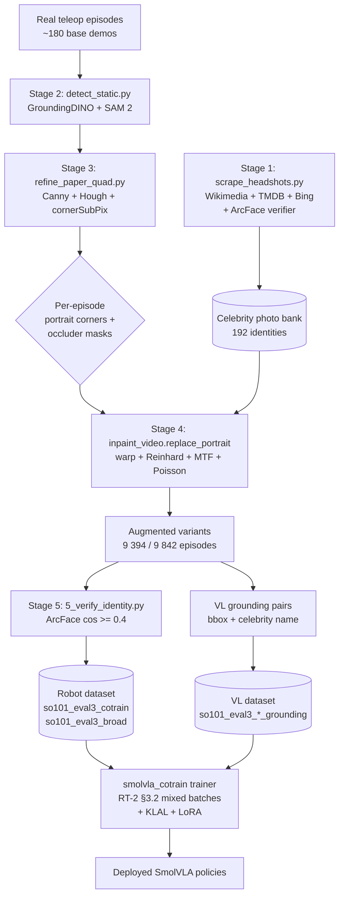
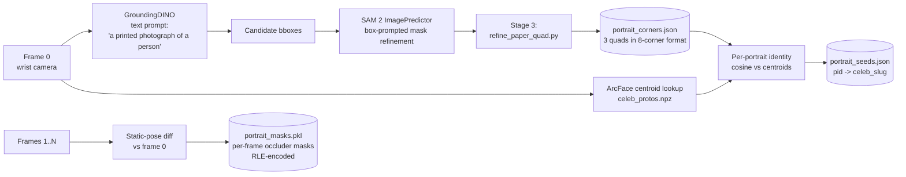
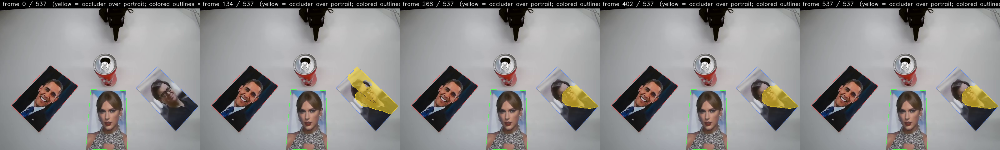
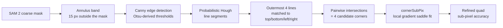
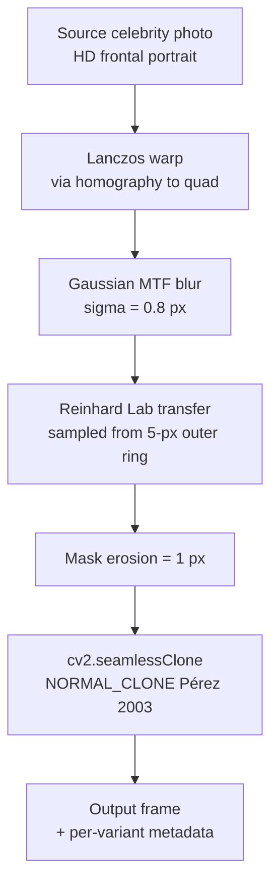
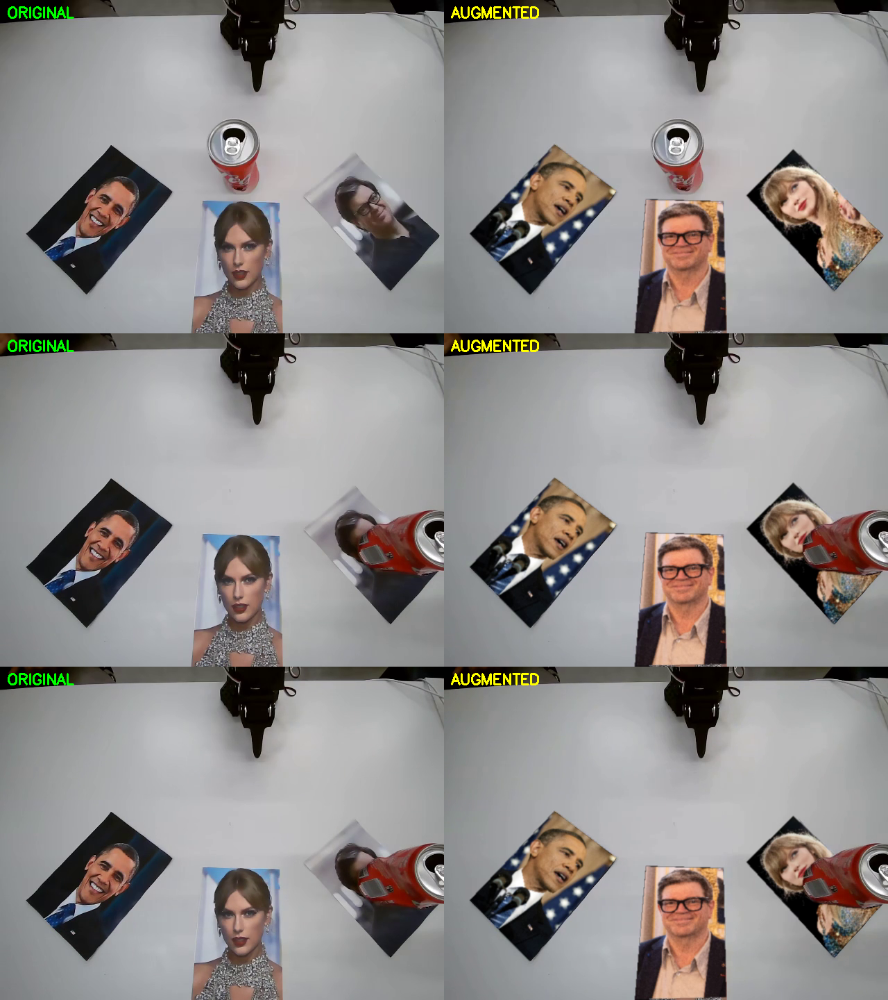

# Augmentation pipeline

The identity-preserving augmentation pipeline + training-time loss/adapter
modules that produced the deployed Eval 3 SmolVLA policies
([`HBOrtiz/so101_smolvla_eval3_cotrain`](https://huggingface.co/HBOrtiz/so101_smolvla_eval3_cotrain),
[`...eval3_broad`](https://huggingface.co/HBOrtiz/so101_smolvla_eval3_broad),
[`...eval3_cotrain_klal`](https://huggingface.co/HBOrtiz/so101_smolvla_eval3_cotrain_klal)).

A few hundred real teleop episodes are multiplied into millions of frames by
re-rendering each base episode with different celebrity faces inpainted onto
the printed portraits. The bounding box and identity of every portrait is
known by construction, so vision-language grounding pairs are emitted
automatically alongside. Co-training SmolVLA on both streams installs the
celebrity knowledge into the policy weights themselves.

Quick links: [`STRATEGY.md`](STRATEGY.md) (the locked design),
[`VALIDATION.md`](VALIDATION.md) (numerical-defaults audit),
[`RESEARCH_face_matching_rescue.md`](RESEARCH_face_matching_rescue.md)
(face-matching rescue plan), [`eval_3/README.md`](../README.md) (task
description + deployed models).

- [End-to-end pipeline](#end-to-end-pipeline)
- [Stage 1: Mining the celebrity bank](#stage-1-mining-the-celebrity-bank)
- [Stage 2: Static-camera portrait detection](#stage-2-static-camera-portrait-detection)
- [Stage 3: Sub-pixel paper-quad refinement](#stage-3-sub-pixel-paper-quad-refinement)
- [Stage 4: Identity-preserving inpainting](#stage-4-identity-preserving-inpainting)
- [Stage 5: Identity verification](#stage-5-identity-verification)
- [Training-time modules: KLAL and LoRA](#training-time-modules-klal-and-lora)
- [File layout](#file-layout)
- [References](#references)

---

## End-to-end pipeline



The dataset half (stages 1-5) lives under `eval_3/aug/`; the training half is
[`eval_3/scripts/smolvla_cotrain/`](../scripts/smolvla_cotrain/) with the
loss + adapter modules consumed from [`training/`](training/).

---

## Stage 1: Mining the celebrity bank

**Module**: [`mining/mine_celeb_photos.py`](mining/mine_celeb_photos.py)
(legacy 3-IID-celeb path) and [`scripts/celebs/scrape_headshots.py`](../scripts/celebs/scrape_headshots.py)
(deployed 192-celebrity bank).

The scraper is a cascade with one design principle: every photo that ends up
in the bank must pass an InsightFace + ArcFace identity check against a
reference embedding. Source order:

1. **Wikidata SPARQL** to resolve a canonical Wikipedia page for the name.
2. **Wikipedia REST page-summary endpoint** for the lead image (high-quality,
   centred portrait, free-license).
3. **Wikimedia Commons category listing** for additional photos of the same
   identity.
4. **TMDB person-images endpoint** (movie / TV figures with curated headshots).
5. **DuckDuckGo image search** as last-resort, gated heavily by face filter.
6. **Bing icrawler** (legacy fallback).

Each candidate goes through:

- [InsightFace](https://github.com/deepinsight/insightface) **RetinaFace**
  detector to find faces ([Deng et al., RetinaFace, CVPR 2020](https://arxiv.org/abs/1905.00641)).
- **ArcFace** ([Deng et al., CVPR 2019](https://arxiv.org/abs/1801.07698))
  embedding, compared against the celebrity's Wikipedia-lead reference
  embedding. The threshold is **cosine >= 0.40**, which the
  ArcFace paper reports as the open-set verification operating point for
  the buffalo_l model (see [`VALIDATION.md`](VALIDATION.md) §1).
- **Perceptual hash de-duplication** (pHash) to drop near-duplicate photos
  across sources.

#### ArcFace recap

ArcFace embeds each face into a 512-D unit vector on the hypersphere and
optimises a classification loss with an additive angular margin penalty
$m$ between the deep feature $x_i$ and its target class weight $W_{y_i}$:

$$
L = -\frac{1}{N} \sum_{i=1}^{N} \log \frac{e^{s \cos(\theta_{y_i} + m)}}{e^{s \cos(\theta_{y_i} + m)} + \sum_{j \neq y_i} e^{s \cos \theta_j}}
$$

The geometric effect is that classes are pushed apart by at least the angle
$m$ on the hypersphere, which gives a tight cosine-similarity cluster per
identity. We use the public `buffalo_l` recipe (ResNet-100 backbone, $s=64$,
$m=0.5$). See Figure 4 of the [ArcFace paper](https://arxiv.org/abs/1801.07698)
for the cosine-distance distribution that motivates our 0.40 threshold.

---

## Stage 2: Static-camera portrait detection

**Module**: [`stages/detect_static.py`](stages/detect_static.py)

The SO-101 wrist-camera is mechanically fixed for the whole episode, and the
three printed portraits do not move across frames. Stage 2 leverages this:
run the heavy detection pipeline **once on frame 0** to find the portrait
quadrilaterals, then propagate a lightweight per-frame **occluder mask**
(gripper, can, hand) by frame-differencing.



#### Visual gate: GroundingDINO + SAM 2 panels

<div align="center">

</div>

The portrait-detection panel (one panel per portrait) shows the GroundingDINO
score (`gdino`), the SAM 2 mask area as a fraction of the bbox (`sam`), and
the ArcFace cosine against the prompted-celebrity centroid (`arcface`). The
green frame is the prompted target; the others are distractors. Rendered by
[`dbg/stage2_panels.py`](dbg/stage2_panels.py) and saved per episode as
`dbg_stage2_portraits.png`.

<div align="center">

</div>

The occluder-detection panel shows the per-frame gripper / can / hand
detections that get subtracted from the inpaint mask in Stage 4 so the
original pixels show through wherever an occluder crosses the portrait.

#### Visual gate: per-frame occluder + portrait masks

<div align="center">

</div>

This is the full-episode mask overlay produced by
[`dbg/segmentation_video.py`](dbg/segmentation_video.py). Each portrait
keeps its fixed quad (static camera); the gripper / can / hand are tracked
through the clip by SAM 2's video predictor seeded from frame 0. The
inpainter subtracts these from the portrait mask per frame so the original
foreground passes through cleanly.

### GroundingDINO

We use [GroundingDINO](https://arxiv.org/abs/2303.05499) (Liu et al., 2023) as
an open-vocabulary detector with the text query
`"a printed photograph of a person"`. The model fuses a Swin-Transformer
image backbone with a BERT text encoder and a cross-modality decoder; the
key idea is **language-guided query selection** (paper Figure 4), which lets
us re-prompt the same checkpoint for different object categories without
fine-tuning. We threshold at `box_threshold = 0.25, text_threshold = 0.20`
and keep the top three boxes by detection score.

### SAM 2

The bounding boxes are then converted to pixel-tight masks with
[**SAM 2**](https://arxiv.org/abs/2408.00714) (Ravi et al., 2024) via the
image-predictor API (`SAM2ImagePredictor.predict(box_prompts=...)`). SAM 2
re-uses the Hiera image encoder from
[SAM](https://arxiv.org/abs/2304.02643) (Kirillov et al., 2023) and adds a
**memory attention** module that enables propagating masks across video
frames (paper Figure 2). We use the image-predictor only at stage 2 (frame 0);
the video-predictor handles occluder propagation through the rest of the
clip.

SAM 2's masks are pixel-tight but tend to **under-cover by 5-15 px** on
planar rigid targets like a printed paper (a known limitation, motivated
e.g. by [SAMRefiner, ICLR 2025](https://arxiv.org/abs/2502.06756)). That
under-coverage is what motivates Stage 3.

---

## Stage 3: Sub-pixel paper-quad refinement

**Module**: [`stages/refine_paper_quad.py`](stages/refine_paper_quad.py)

SAM 2 gives a mask; we want the four corners of the paper at sub-pixel
precision so the homography in Stage 4 lines up. Three classical
computer-vision primitives, chained:



The full chain:

1. **Annulus band** of width 15 px outside the SAM mask. We restrict the
   downstream Canny / Hough to this band so the paper's *external* edge is
   the only one in play (the celebrity's own silhouette is inside the
   mask and is intentionally hidden).
2. **Canny** ([Canny 1986, IEEE TPAMI](https://ieeexplore.ieee.org/document/4767851))
   with thresholds derived from Otsu's grayscale histogram:
   `high = otsu_value`, `low = 0.5 * otsu_value`. The 2:1 ratio is the one
   validated by Fang et al., *ICIP 2009*.
3. **Probabilistic Hough** ([Matas, Galambos & Kittler, CVIU 2000](https://www.sciencedirect.com/science/article/abs/pii/S107731420090776X))
   with `HoughLinesP`, `min_votes = 15`, `min_length = 20 px`,
   `max_gap = 15 px`. The Hough transform votes each candidate edge pixel
   into the parameter space $(\rho, \theta)$ and selects the top-k local
   maxima.
4. **Outermost-line selection**: from the Hough candidates we pick four
   lines, one per side, that lie *outside* the SAM mask's principal axis
   (top, bottom, left, right). The selection step is what gives the
   "paper edge" interpretation; without it Hough would happily return
   internal edges (face silhouette, etc).
5. **Corners**: pairwise intersections of adjacent sides yield four
   approximate corners.
6. **cornerSubPix** ([Förstner & Gülch 1987](https://www.researchgate.net/publication/265041280_A_Fast_Operator_for_Detection_and_Precise_Location_of_Distinct_Points_Corners_and_Centres_of_Circular_Features))
   snaps each corner to the local gradient saddle, giving sub-pixel
   accuracy.

The refined quad replaces the SAM mask for downstream stages.

---

## Stage 4: Identity-preserving inpainting

**Module**: [`stages/inpaint_video.py`](stages/inpaint_video.py)

The compositing engine. For each frame, for each portrait, replace the
printed-face region with a new celebrity photo while preserving:

- camera optics (the new photo must look like it was photographed by the
  same wrist webcam),
- local lighting (the new photo must inherit the table's color cast and
  shadow), and
- the seam (no visible boundary between the inpainted patch and the
  original frame).



#### Visual gate: original vs augmented, side by side

<div align="center">

</div>

Left half is the raw teleop clip; right half is the augmented variant
(different celebrities, different layout) rendered by the pipeline above.
Action stream, camera pose, gripper trajectory, table layout, and lighting
are unchanged; only the three portraits on the table have been replaced.
This decoupling is what makes the augmented variants safe to mix into the
SmolVLA / Pi0.5 training stream without disturbing the action loss.
Generated by [`dbg/compare_gif.py`](dbg/compare_gif.py).

<div align="center">

</div>

A static three-frame composite from the same script, useful for diff'ing
the photo seams and color cast without the GIF's flicker.

### Step-by-step

**Lanczos warp.** A homography is fitted from the source photo's four
corners (assumed axis-aligned, top-left clockwise) to the refined target
quad from Stage 3. The warp uses
$\text{INTER\_LANCZOS4}$ resampling for high-frequency detail preservation.

**Gaussian MTF blur** ($\sigma = 0.8$ px). The source celebrity photo is a
clean high-resolution image; the wrist camera is a consumer USB webcam
with measurable optical blur. A single isotropic Gaussian with
$\sigma \approx 0.8$ px matches the average modulation-transfer-function
of 640×480 USB webcams ([Mosleh et al., CVPR 2015, *Camera Intrinsic Blur
Kernel Estimation*](https://openaccess.thecvf.com/content_cvpr_2015/papers/Mosleh_Camera_Intrinsic_Blur_2015_CVPR_paper.pdf)).
Without this step the inpainted region looks suspiciously sharp.

**Reinhard Lab-space color transfer.** Sample a thin 5-px-wide ring of
pixels *just outside* the portrait quad, convert to the
[Lab color space](https://en.wikipedia.org/wiki/CIELAB_color_space), and
re-mean / re-stddev the warped photo so its (L, a, b) statistics match the
ring:

$$
L'_p = \frac{\sigma^{L}_\text{ring}}{\sigma^{L}_\text{photo}} \cdot (L_p - \mu^{L}_\text{photo}) + \mu^{L}_\text{ring}
$$

(and analogously for $a, b$). This is [Reinhard et al., 2001, *Color Transfer
between Images*, IEEE CG&A](https://www.cs.tau.ac.il/~turkel/imagepapers/ColorTransfer.pdf).
It is what makes the inpainted portrait inherit the table's warm tungsten
lighting cast and feel like part of the same scene. The standard deviation
ratio is clamped to $[0.3, 2.0]$ to preserve dynamic range when the ring is
near-uniform.

**Mask erosion** (1 px). Without erosion, the Poisson seamless-clone in the
next step would have to integrate over discretisation-noisy boundary
pixels, which causes a faint halo. One pixel of erosion is enough to avoid
the issue; more (the OpenCV default of 3+) over-erodes and shrinks the
visible portrait. See [`VALIDATION.md`](VALIDATION.md) §4.

**Poisson seamless cloning** (`cv2.seamlessClone(..., NORMAL_CLONE)`). This
is [Pérez et al., SIGGRAPH 2003, *Poisson Image Editing*](http://www.irisa.fr/vista/Papers/2003_siggraph_perez.pdf)
Eq. 11. The cloning solves for an inpainted region $f$ that has the
**gradient field of the source** but matches the **boundary values of the
target**:

$$
\min_f \iint_\Omega |\nabla f - \mathbf{v}|^2 \quad \text{s.t.} \quad f|_{\partial \Omega} = f^*|_{\partial \Omega}
$$

where $\mathbf{v} = \nabla g$ is the source-photo gradient field and $f^*$
is the destination frame. The Euler-Lagrange equation reduces to a Poisson
PDE with Dirichlet boundary conditions, $\Delta f = \text{div}\,\mathbf{v}$.
The `NORMAL_CLONE` flag uses the pure source gradient (vs `MIXED_CLONE`
which mixes the larger of the source and target gradients per pixel).
For our use case the source-pure variant is correct: we want the new
celebrity face fully transplanted, with the destination only contributing
its boundary lighting. See Figures 2-3 of the Pérez paper for the
canonical comparison.

### Per-frame composition

For frames after frame 0, the portrait quad is constant (camera-static) but
**occluders** (the gripper closing on the can, the can mid-flight, an
operator hand) intermittently cover parts of the portrait. The composition
operator subtracts the occluder mask (a SAM 2 video-predictor track from
the gripper-can-hand seed) from the inpaint mask, so the original frame
pixels show through where they should.

---

## Stage 5: Identity verification

**Module**: [`_legacy/stage5_verify_identity.py`](_legacy/stage5_verify_identity.py)
(now under `_legacy/`; the production generators apply the same check
inline; see [`generators/broad.py`](generators/broad.py) `process_episode`).

For each augmented variant, sample five frames, ArcFace-embed the
inpainted portrait, and assert the cosine similarity to the new celebrity's
reference embedding is `>= 0.40`. Variants that fail this check are dropped
from the dataset. This is the same threshold and the same embedding model
used in Stage 1 mining; it certifies that the inpainting did not destroy
the source identity.

---

## Training-time modules: KLAL and LoRA

These are not part of the dataset-building pipeline; they live under
[`training/`](training/) and are imported by the SmolVLA cotrain trainer at
[`eval_3/scripts/smolvla_cotrain/cotrain.py`](../scripts/smolvla_cotrain/cotrain.py).
The full math, motivation, and integration details are in the
[Eval 3 README](../README.md#our-approach-co-training--klal--lora);
this section is the module-level summary.

### KLAL hooksets

The KL Attention Loss from [WACV 2026](https://arxiv.org/abs/2511.12738)
(Wu et al., 2026) supervises the model's attention from name-tokens to
image-patches against a Gaussian target built from the known portrait
bbox.

| File | Forward path |
|---|---|
| [`training/klal_core.py`](training/klal_core.py) | Model-agnostic loss + target + Pi0.5/PaliGemma hookset. |
| [`training/klal_smolvla_action.py`](training/klal_smolvla_action.py) | SmolVLA action-forward hookset. |
| [`training/klal_smolvla_vl.py`](training/klal_smolvla_vl.py) | SmolVLA VL-forward hookset (deployed under `enable_klal=True`). |

#### Formulation recap

For each monitored layer $\ell \in \mathcal{L}$ the attention from name
tokens to image patches is recomputed (RoPE applied) and the loss is

$$
\mathcal{L}_\text{KLAL} = \frac{1}{|\mathcal{L}|} \sum_{\ell \in \mathcal{L}} \mathrm{KL}\!\left(P_\text{target}(\mathcal{S}) \,\|\, Q^{(\ell)}(\mathcal{S})\right)
$$

with $P_\text{target}$ an isotropic 2-D Gaussian on the bbox centroid (our
deviation from the WACV 2026 paper, which uses an elongated target tuned
for RefCOCO). See [`klal_core.py`](training/klal_core.py) module docstring
for the full derivation.

<div align="center">

</div>

Panel A is the wrist-cam frame 0 with the three portrait quads (green is
the prompted target, red are distractors). Panel B is the per-pixel
isotropic Gaussian centered on the target centroid with standard
deviations scaled to the bbox extents. Panel C downsamples that Gaussian
to the 8x8 patch grid SmolVLM2 actually receives, normalised to a
probability distribution. This grid is $P_\text{target}(\mathcal{S})$; the
loss compares the model's softmax attention $Q^{(\ell)}(\mathcal{S})$
against it via KL divergence.

### LoRA

[`training/lora_smolvla.py`](training/lora_smolvla.py) is a minimal
LoRA implementation ([Hu et al., 2021](https://arxiv.org/abs/2106.09685))
that wraps each `nn.Linear` in `q_proj, k_proj, v_proj, o_proj` with a
trainable low-rank delta:

$$
y = W_0 x + \frac{\alpha}{r} \cdot B A x
$$

with $A \in \mathbb{R}^{r \times d_\text{in}}$ Kaiming-initialised,
$B \in \mathbb{R}^{d_\text{out} \times r}$ zero-initialised, and the
base linear frozen. We use $r = 16, \alpha = 32$ on layers $[9..15]$ of
SmolVLM2's text model. The LoRA delta is **merged into the base weights at
checkpoint time** so the published policy loads as a vanilla
`SmolVLAPolicy` with no extra inference dependency. Figure 1 of the LoRA
paper gives the canonical visualisation of the rank-decomposition
parameterisation.

LoRA is required for KLAL to do anything: KLAL supervises the attention
computed from $q_\ell, k_\ell$ at layers $\ell \in \mathcal{L}_\text{KLAL}$.
If those projections were frozen (as they are under SmolVLA's
`train_expert_only=True` default), KLAL would back-propagate into frozen
weights and learn nothing. The LoRA layer set must therefore be a superset
of the KLAL-supervised layers (caller's responsibility).

---

## File layout

```text
eval_3/aug/
├── README.md                          this file
├── STRATEGY.md                        locked design rationale (v3, Path A)
├── VALIDATION.md                      triple-source audit of numerical defaults
├── RESEARCH_face_matching_rescue.md   the rescue-plan research synthesis
│
├── stages/                            per-stage pipeline primitives (libraries + CLIs)
│   ├── detect_static.py                static-camera portrait detection + per-frame occluders
│   ├── refine_paper_quad.py            sub-pixel paper-edge refit (Canny + Hough + cornerSubPix)
│   ├── refine_corners_frame0.py        one-shot refit of frame-0 corners post-detect_static
│   ├── inpaint_video.py                composite engine (warp + Reinhard + MTF + seamlessClone)
│   └── video_io.py                     AV1 -> H.264 sidecar transcode + frame iterators
│
├── mining/
│   └── mine_celeb_photos.py            Wikimedia + icrawler scrape + ArcFace verifier
│
├── generators/                         variant dataset builders (call into stages/)
│   ├── broad.py                        195-celeb out-of-distribution generator
│   ├── broad_topup.py                   patch run for celebs missed by broad.py
│   ├── cotrain.py                      3-IID-celeb full-enumeration generator
│   └── build_cotrain_bank.py           8-photo-per-celeb bank for cotrain.py
│
├── merge_prep/                         post-augmentation LeRobotDataset fixups
│   ├── prep_for_merge.py
│   ├── patch_episodes_parquet.py
│   ├── relabel_cotrain_prompts.py
│   ├── fix_merged_tasks.py
│   ├── regen_default_prompts.py        deterministic default-bucket paraphrase regenerator
│   └── validate_merged.py
│
├── training/                           consumed by eval_3/scripts/smolvla_cotrain/cotrain.py
│   ├── klal_core.py                    KLALConfig + klal_loss + gaussian_target_from_mask
│   ├── klal_smolvla_action.py          KLAL hookset on the robot-action forward
│   ├── klal_smolvla_vl.py              KLAL hookset on the VL co-training forward (deployed)
│   └── lora_smolvla.py                 LoRA on SmolVLA VLM attention projections
│
├── dbg/                                visual-gate scripts
│   ├── compare_gif.py                  side-by-side original vs augmented
│   ├── mask_overlay.py                 portrait quad + occluder mask overlay
│   ├── segmentation_video.py           full-clip mask overlay
│   └── stage2_panels.py                detect_static.py decision panels
│
├── tests/
│   ├── test_replace_portrait.py        synthetic regression on inpaint_video.replace_portrait
│   └── test_klal_lora_smoke.py         two-tier pure-logic + real-SmolVLA forward gate
│
└── _legacy/                            v1 pipeline + superseded research
                                        (see _legacy/README.md)
```

---

## References

Method papers we directly build on. Bibliographic detail in
[`STRATEGY.md`](STRATEGY.md) §10 (the canonical citation list); short list
here for quick reference.

### Detection + segmentation

- Liu et al., **Grounding DINO: Marrying DINO with Grounded Pre-Training for
  Open-Set Object Detection** (2023). [arXiv:2303.05499](https://arxiv.org/abs/2303.05499).
  Open-vocabulary detector we re-prompt with `"a printed photograph of a person"`.
- Ravi et al., **SAM 2: Segment Anything in Images and Videos** (2024).
  [arXiv:2408.00714](https://arxiv.org/abs/2408.00714). Image-predictor for
  mask refinement; video-predictor for occluder propagation.
- Kirillov et al., **Segment Anything** (ICCV 2023). [arXiv:2304.02643](https://arxiv.org/abs/2304.02643).
  The SAM 1 paper that introduced the box-prompt + image-encoder pattern
  that SAM 2 extends.
- Lin et al., **SAMRefiner: Taming Segment Anything Model for Refining
  High-Quality Masks** (ICLR 2025). [arXiv:2502.06756](https://arxiv.org/abs/2502.06756).
  Documents SAM 2's under-coverage on planar rigid targets; motivates Stage 3.

### Classical sub-pixel refinement

- Canny, **A Computational Approach to Edge Detection** (IEEE TPAMI 1986).
- Otsu, **A Threshold Selection Method from Gray-Level Histograms** (IEEE
  Trans. SMC 1979).
- Matas, Galambos & Kittler, **Robust Detection of Lines Using the
  Progressive Probabilistic Hough Transform** (CVIU 2000).
- Förstner & Gülch, **A Fast Operator for Detection and Precise Location
  of Distinct Points, Corners and Centres of Circular Features** (1987).
  Theoretical basis for OpenCV's `cornerSubPix`.

### Color transfer + Poisson editing

- Reinhard, Ashikhmin, Gooch & Shirley, **Color Transfer between Images**
  (IEEE CG&A 2001). [PDF](https://www.cs.tau.ac.il/~turkel/imagepapers/ColorTransfer.pdf).
  Used for Lab-space ring-sample local white balance.
- Pérez, Gangnet & Blake, **Poisson Image Editing** (SIGGRAPH 2003).
  [PDF](http://www.irisa.fr/vista/Papers/2003_siggraph_perez.pdf).
  The `NORMAL_CLONE` operator for the seam.
- Mosleh et al., **Camera Intrinsic Blur Kernel Estimation** (CVPR 2015).
  Measured webcam MTF distributions that justify our $\sigma = 0.8$ px
  Gaussian.

### Face verification

- Deng et al., **ArcFace: Additive Angular Margin Loss for Deep Face
  Recognition** (CVPR 2019). [arXiv:1801.07698](https://arxiv.org/abs/1801.07698).
  The face embedder used by the photo-bank scraper and the inpainting
  verifier.
- Deng et al., **RetinaFace: Single-shot Multi-level Face Localisation in
  the Wild** (CVPR 2020). [arXiv:1905.00641](https://arxiv.org/abs/1905.00641).
  The face detector bundled with InsightFace `buffalo_l`.
- Cao et al., **VGGFace2: A Dataset for Recognising Faces across Pose and
  Age** (2017). [arXiv:1710.08092](https://arxiv.org/abs/1710.08092). The
  PaliGemma warm-start data source (Pi0.5 variant only).
- Schroff et al., **FaceNet: A Unified Embedding for Face Recognition and
  Clustering** (CVPR 2015). [arXiv:1503.03832](https://arxiv.org/abs/1503.03832).
  The triplet-anchor / positive / negative convention we follow at
  augmentation time.

### Training-time loss + adapter

- Wu et al., **Direct Visual Grounding by Directing Attention of Visual
  Tokens** (WACV 2026). [arXiv:2511.12738](https://arxiv.org/abs/2511.12738).
  The KLAL formulation.
- Hu et al., **LoRA: Low-Rank Adaptation of Large Language Models**
  (ICLR 2022). [arXiv:2106.09685](https://arxiv.org/abs/2106.09685).
  Our adapter.

### Co-training + VLA backbone

- Brohan et al., **RT-2: Vision-Language-Action Models Transfer Web Knowledge
  to Robotic Control** (2023). [arXiv:2307.15818](https://arxiv.org/abs/2307.15818).
  The §3.2 co-fine-tuning recipe.
- Sun et al., **ObjectVLA: End-to-End Open-World Object Manipulation Without
  Demonstration** (2025). [arXiv:2502.11550](https://arxiv.org/abs/2502.11550).
  The 10:1 robot:VL bbox-grounded recipe.
- Shukor et al., **SmolVLA: A Vision-Language-Action Model for Affordable
  and Efficient Robotics** (2025). [arXiv:2506.01844](https://arxiv.org/abs/2506.01844).
  Our backbone.

### Shortcut-learning evidence

- Liu et al., **LIBERO-Plus: In-Depth Robustness Analysis of Vision-Language-Action
  Models** (2025). [arXiv:2510.13626](https://arxiv.org/abs/2510.13626).
- Wang et al., **Shortcut Learning in Generalist Robot Policies** (2025).
  [arXiv:2508.06426](https://arxiv.org/abs/2508.06426).
- Geirhos et al., **Shortcut Learning in Deep Neural Networks** (2020).
  [arXiv:2004.07780](https://arxiv.org/abs/2004.07780).
