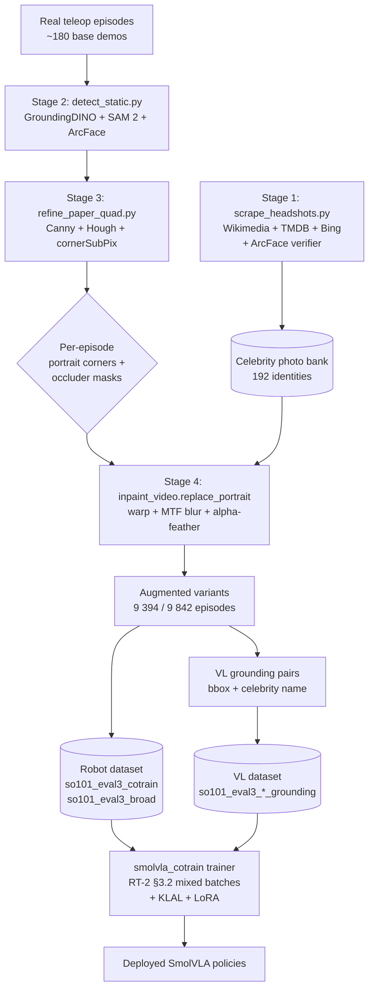
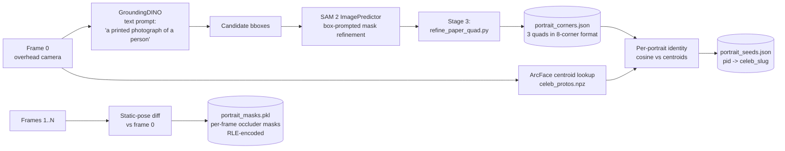
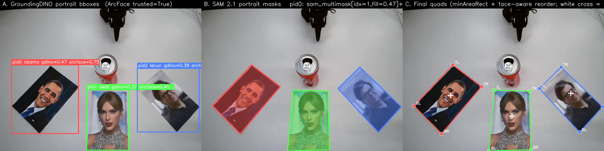
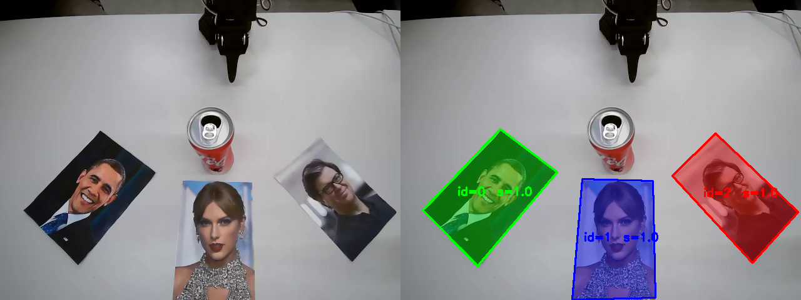
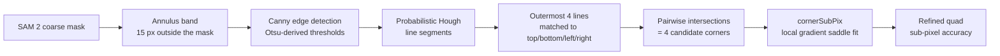
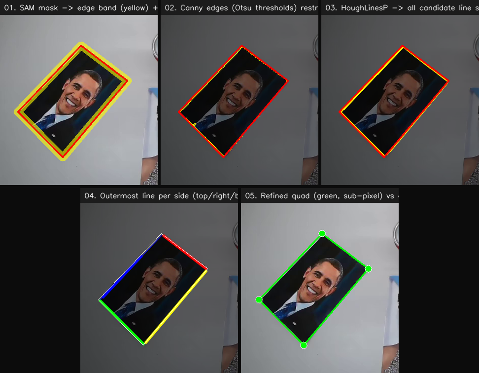
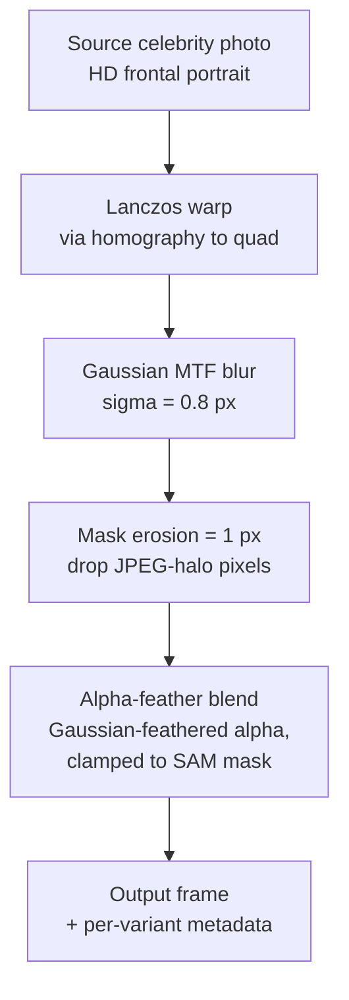
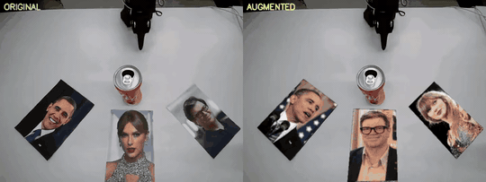
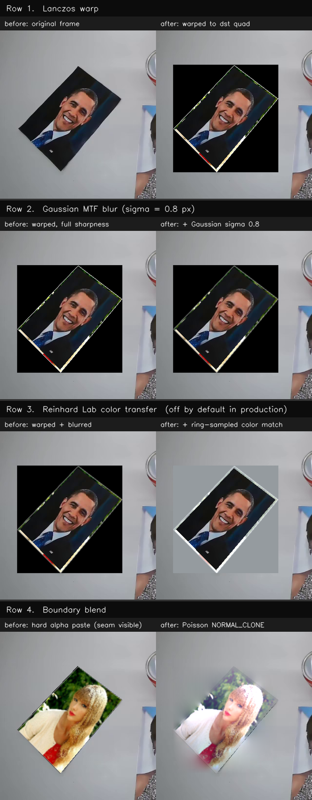

# Augmentation pipeline

The identity-preserving augmentation pipeline that produced the deployed
Eval 3 SmolVLA policies
([`HBOrtiz/so101_smolvla_eval3_cotrain`](https://huggingface.co/HBOrtiz/so101_smolvla_eval3_cotrain),
[`...eval3_broad`](https://huggingface.co/HBOrtiz/so101_smolvla_eval3_broad),
[`...eval3_cotrain_klal`](https://huggingface.co/HBOrtiz/so101_smolvla_eval3_cotrain_klal)).

A few hundred real teleop episodes are multiplied into millions of frames by
re-rendering each base episode with different celebrity faces inpainted onto
the printed portraits. The bounding box and identity of every portrait is
known by construction, so vision-language grounding pairs are emitted
automatically alongside. Co-training SmolVLA on both streams installs the
celebrity knowledge into the policy weights themselves.

For the task description, deployed models, and the cotrain + KLAL + LoRA
write-up, see [`eval_3/README.md`](../README.md). The training-side
modules that consume the output of this pipeline (KLAL loss, LoRA adapter,
SmolVLA cotrain trainer) live under
[`eval_3/scripts/smolvla_cotrain/`](../scripts/smolvla_cotrain/).

- [End-to-end pipeline](#end-to-end-pipeline)
- [Stage 1: Mining the celebrity bank](#stage-1-mining-the-celebrity-bank)
- [Stage 2: Detect the 3 portraits + track occluders](#stage-2-detect-the-3-portraits--track-occluders)
- [Stage 3: Sub-pixel paper-quad refinement](#stage-3-sub-pixel-paper-quad-refinement)
- [Stage 4: Identity-preserving inpainting](#stage-4-identity-preserving-inpainting)
- [File layout](#file-layout)
- [References](#references)

---

## End-to-end pipeline



### Pipeline at a glance

| Stage | What it produces | When it runs | Module |
|---|---|---|---|
| **1.** Build photo bank | 192 ArcFace-verified celebrity photos | **once** for the project | [`scripts/celebs/scrape_headshots.py`](../scripts/celebs/scrape_headshots.py) |
| **2a.** Find the 3 portraits (frame 0) | bbox + SAM mask + identity per portrait | once per base teleop, **frame 0 only** | [`stages/detect_static.py`](stages/detect_static.py) |
| **2b.** Track occluders | per-frame mask of gripper / can / hand | once per base teleop, **all frames** | same module |
| **3.** Refine portrait boundaries | 4 sub-pixel corners per portrait | once per base teleop, frame 0 | [`stages/refine_paper_quad.py`](stages/refine_paper_quad.py) |
| **4.** Render inpainted variant | augmented MP4 with new celebrity faces | once **per (episode, variant)** pair | [`stages/inpaint_video.py`](stages/inpaint_video.py) |

Read sequentially: Stages 1, 2a, 2b, 3 prepare; Stage 4 renders. The
training-side modules that consume what this pipeline emits (KLAL loss,
LoRA adapter, the cotrain trainer itself) all live under
[`eval_3/scripts/smolvla_cotrain/`](../scripts/smolvla_cotrain/).

---

## Stage 1: Mining the celebrity bank

**Module**: [`scripts/celebs/scrape_headshots.py`](../scripts/celebs/scrape_headshots.py)
(deployed 192-celebrity bank) and [`scripts/celebs/mine_celeb_photos.py`](../scripts/celebs/mine_celeb_photos.py)
(legacy 3-IID-celeb path). Both feed the same photo-bank format consumed
by Stage 4.

The scraper is a cascade with one design principle: every photo that ends up
in the bank must pass an InsightFace + ArcFace identity check against a
reference embedding. Source order:

1. **Wikidata SPARQL** to resolve a canonical Wikipedia page for the name.
2. **Wikipedia REST page-summary endpoint** for the lead image (high-quality,
   centred portrait, free-license).
3. **Wikimedia Commons category listing** for additional photos of the same
   identity.
4. **TMDB person-images endpoint** (movie / TV figures with curated headshots).
5. **DuckDuckGo image search** as last-resort, gated heavily by face filter.
6. **Bing icrawler** (legacy fallback).

Each candidate goes through:

- [InsightFace](https://github.com/deepinsight/insightface) **RetinaFace**
  detector to find faces ([Deng et al., RetinaFace, CVPR 2020](https://arxiv.org/abs/1905.00641)).
- **ArcFace** ([Deng et al., CVPR 2019](https://arxiv.org/abs/1801.07698))
  embedding, compared against the celebrity's Wikipedia-lead reference
  embedding. The threshold is **cosine >= 0.40**, which the
  ArcFace paper reports as the open-set verification operating point for
  the buffalo_l model.
- **Perceptual hash de-duplication** (pHash) to drop near-duplicate photos
  across sources.

#### ArcFace recap

ArcFace embeds each face into a 512-D unit vector on the hypersphere and
optimises a classification loss with an additive angular margin penalty
$m$ between the deep feature $x_i$ and its target class weight $W_{y_i}$:

$$
L = -\frac{1}{N} \sum_{i=1}^{N} \log \frac{e^{s \cos(\theta_{y_i} + m)}}{e^{s \cos(\theta_{y_i} + m)} + \sum_{j \neq y_i} e^{s \cos \theta_j}}
$$

The geometric effect is that classes are pushed apart by at least the angle
$m$ on the hypersphere, which gives a tight cosine-similarity cluster per
identity. We use the public `buffalo_l` recipe (ResNet-100 backbone, $s=64$,
$m=0.5$). See Figure 4 of the [ArcFace paper](https://arxiv.org/abs/1801.07698)
for the cosine-distance distribution that motivates our 0.40 threshold.

---

## Stage 2: Detect the 3 portraits + track occluders

**Module**: [`stages/detect_static.py`](stages/detect_static.py)

The SO-101 overhead camera is mechanically fixed for the whole episode and the
three printed portraits do not move. Stage 2 leverages this with **two
distinct sub-tasks** that share one pass through the video:

- **Stage 2a (frame 0 only)** runs the heavy detector to find the portrait
  quadrilaterals and identify which celebrity sits at each slot. Output
  feeds Stage 3 (boundary refinement) and Stage 4 (inpainting).
- **Stage 2b (all frames)** propagates a lightweight per-frame occluder
  mask (gripper, can, hand) by frame-differencing against frame 0. Output
  feeds Stage 4 directly.



### Stage 2a. Detect + identify the 3 portraits at frame 0

GroundingDINO (open-vocab text-prompted detector) returns the top three
bbox candidates; SAM 2's image predictor turns each bbox into a pixel-tight
mask; ArcFace embeds each mask region and assigns the celebrity whose
centroid yields the highest cosine.

<div align="center">

</div>

Per-portrait panel (one per slot): GroundingDINO score (`gdino`), SAM 2
mask area as a fraction of the bbox (`sam`), ArcFace cosine to the
prompted celebrity (`arcface`). The green frame is the prompted target;
the others are distractors. Rendered by
[`dbg/stage2_panels.py`](dbg/stage2_panels.py); saved per episode as
`dbg_stage2_portraits.png`.

<div align="center">

</div>

The three colored regions are the SAM 2 portrait masks at frame 0
(`portrait_masks.pkl["M_0_per_pid"]`) overlaid on the raw overhead-cam
frame. This is the per-portrait mask Stage 4's inpainter uses as its
`dst_mask`. Rendered by [`dbg/mask_overlay.py`](dbg/mask_overlay.py).

### Stage 2b. Track the gripper / can / hand across the clip

SAM 2's video predictor is seeded with frame-0 occluder boxes (from
GroundingDINO prompts `"robot gripper"` and `"coca cola can"`) and
propagates the masks through every frame. The inpainter subtracts these
per-frame masks from the portrait mask so the gripper / can / hand pass
through cleanly without being inpainted over.

<div align="center">

</div>

Full-episode mask overlay from [`dbg/segmentation_video.py`](dbg/segmentation_video.py).
Color legend:

- **Green / blue / red:** the three portrait masks (visible paper at the
  current frame), one color per pid (`M_0_per_pid` minus whatever is on
  top of it at frame `fi`).
- **Yellow:** the **occluder mask** at the current frame, computed as
  `M_0_pid AND NOT visible_pid` and unioned across the three portraits.
  This is exactly the region the inpainter must NOT overwrite at this
  frame, because something (gripper, can, hand) is sitting on top of
  the paper there.

Each portrait keeps its fixed quad (static camera); watch the yellow
occluder mask track the gripper + can across the clip as they reach for
the target. The per-frame view is the only reliable way to see the
tracker working: any static frame-0 panel can include false positives
that the filter at [`detect_static.py:218`](stages/detect_static.py#L218)
drops later, or that SAM 2 corrects via its multi-frame propagation.

### GroundingDINO

We use [GroundingDINO](https://arxiv.org/abs/2303.05499) (Liu et al., 2023) as
an open-vocabulary detector with the text query
`"a printed photograph of a person"`. The model fuses a Swin-Transformer
image backbone with a BERT text encoder and a cross-modality decoder; the
key idea is **language-guided query selection** (paper Figure 4), which lets
us re-prompt the same checkpoint for different object categories without
fine-tuning. We threshold at `box_threshold = 0.25, text_threshold = 0.20`
and keep the top three boxes by detection score.

### SAM 2

The bounding boxes are then converted to pixel-tight masks with
[**SAM 2**](https://arxiv.org/abs/2408.00714) (Ravi et al., 2024) via the
image-predictor API (`SAM2ImagePredictor.predict(box_prompts=...)`). SAM 2
re-uses the Hiera image encoder from
[SAM](https://arxiv.org/abs/2304.02643) (Kirillov et al., 2023) and adds a
**memory attention** module that enables propagating masks across video
frames (paper Figure 2). We use the image-predictor only at stage 2 (frame 0);
the video-predictor handles occluder propagation through the rest of the
clip.

SAM 2's masks are pixel-tight but tend to **under-cover by 5-15 px** on
planar rigid targets like a printed paper (a known limitation, motivated
e.g. by [SAMRefiner, ICLR 2025](https://arxiv.org/abs/2502.06756)). That
under-coverage is what motivates Stage 3.

---

## Stage 3: Sub-pixel paper-quad refinement

**Module**: [`stages/refine_paper_quad.py`](stages/refine_paper_quad.py)

SAM 2 gives a mask; we want the four corners of the paper at sub-pixel
precision so the homography in Stage 4 lines up. Three classical
computer-vision primitives, chained:



#### Visual gate: the refit pipeline on a real portrait

<div align="center">

</div>

The five panels are the intermediate outputs the refit dumps at every
step when `debug_dir` is set ([`refine_paper_quad_to_edges`](stages/refine_paper_quad.py#L248)),
cropped to the portrait region and stacked here. Reading left to right,
top to bottom:

1. **SAM mask -> edge band.** Dilate the SAM mask by +20 px and AND with NOT-erode (also +20 px). The true paper edge lives in this thin yellow ring; the red quad is SAM's coarse corner estimate.
2. **Canny edges in band.** Canny with Otsu-derived thresholds (high = Otsu, low = 0.5x Otsu, the Fang-et-al. ICIP 2009 ratio), restricted to the band so that printed-content edges inside the paper can't compete.
3. **HoughLinesP.** Probabilistic Hough returns line segments; we keep all candidates here for visualisation. Many segments will end up clustered around the four true sides.
4. **Outermost line per side.** Cluster the segments into 4 orientation bins (top / right / bottom / left relative to the coarse-quad centroid), pick the one farthest OUT in each bin. Printed-content edges always sit inside the paper margin, so the outermost is always the true paper edge.
5. **Refined quad (green) vs coarse (red).** Intersect the 4 outermost lines pairwise, then `cv2.cornerSubPix` snaps each intersection to the local gradient saddle (Förstner & Gülch 1987). Final corners are typically less than 0.5 px off the true paper edge.

Rendered by [`dbg/refine_quad_panels.py`](dbg/refine_quad_panels.py); any
base teleop with `portrait_masks.pkl` + `portrait_corners.json` can be
fed in.

The full chain:

1. **Annulus band** of width 15 px outside the SAM mask. We restrict the
   downstream Canny / Hough to this band so the paper's *external* edge is
   the only one in play (the celebrity's own silhouette is inside the
   mask and is intentionally hidden).
2. **Canny** ([Canny 1986, IEEE TPAMI](https://ieeexplore.ieee.org/document/4767851))
   with thresholds derived from Otsu's grayscale histogram:
   `high = otsu_value`, `low = 0.5 * otsu_value`. The 2:1 ratio is the one
   validated by Fang et al., *ICIP 2009*.
3. **Probabilistic Hough** ([Matas, Galambos & Kittler, CVIU 2000](https://www.sciencedirect.com/science/article/abs/pii/S107731420090776X))
   with `HoughLinesP`, `min_votes = 15`, `min_length = 20 px`,
   `max_gap = 15 px`. The Hough transform votes each candidate edge pixel
   into the parameter space $(\rho, \theta)$ and selects the top-k local
   maxima.
4. **Outermost-line selection**: from the Hough candidates we pick four
   lines, one per side, that lie *outside* the SAM mask's principal axis
   (top, bottom, left, right). The selection step is what gives the
   "paper edge" interpretation; without it Hough would happily return
   internal edges (face silhouette, etc).
5. **Corners**: pairwise intersections of adjacent sides yield four
   approximate corners.
6. **cornerSubPix** ([Förstner & Gülch 1987](https://www.researchgate.net/publication/265041280_A_Fast_Operator_for_Detection_and_Precise_Location_of_Distinct_Points_Corners_and_Centres_of_Circular_Features))
   snaps each corner to the local gradient saddle, giving sub-pixel
   accuracy.

The refined quad replaces the SAM mask for downstream stages.

---

## Stage 4: Identity-preserving inpainting

**Module**: [`stages/inpaint_video.py`](stages/inpaint_video.py)

The compositing engine. For each frame, for each portrait, replace the
printed-face region with a new celebrity photo while preserving:

- camera optics (the new photo must look like it was photographed by the
  same overhead webcam),
- local lighting (the new photo must inherit the table's color cast and
  shadow), and
- the seam (no visible boundary between the inpainted patch and the
  original frame).



#### Visual gate: original vs augmented, side by side

<div align="center">

</div>

Left half is the raw teleop clip; right half is the augmented variant
(different celebrities, different layout) rendered by the pipeline above.
Action stream, camera pose, gripper trajectory, table layout, and lighting
are unchanged; only the three portraits on the table have been replaced.
This decoupling is what makes the augmented variants safe to mix into the
SmolVLA training stream (and the Pi0.5 variant) without disturbing the
action loss. Generated by [`dbg/compare_gif.py`](dbg/compare_gif.py).

### Step-by-step

<div align="center">

</div>

The panel pairs the **before** (output of the previous step, left column)
against the **after** (this step's output, right column) for the three
transforms the deployed pipeline actually runs. Same source photo, same
destination quad, same overhead-cam frame throughout, so the visual delta
is exactly the effect of that step alone. Rendered by
[`dbg/stage4_steps_panel.py`](dbg/stage4_steps_panel.py) on a real
base-teleop frame, swapping the existing portrait with a Taylor Swift
photo from our scraped bank.

**Row 1. Lanczos warp.** A homography is fitted from the source photo's
four corners (assumed axis-aligned, top-left clockwise) to the refined
target quad from Stage 3. The warp uses `cv2.INTER_LANCZOS4` resampling
for high-frequency detail preservation.

**Row 2. Gaussian MTF blur** ($\sigma = 0.8$ px). The source photo is a
clean high-resolution image; the overhead camera is a consumer USB webcam
with measurable optical blur. A single isotropic Gaussian with
$\sigma \approx 0.8$ px matches the average modulation-transfer-function
of 640x480 USB webcams ([Mosleh et al., CVPR 2015, *Camera Intrinsic Blur
Kernel Estimation*](https://openaccess.thecvf.com/content_cvpr_2015/papers/Mosleh_Camera_Intrinsic_Blur_2015_CVPR_paper.pdf)).
Without this step the inpainted region looks suspiciously sharp.

**Row 3. Alpha-feather composite** (the deployed default
[`blend_mode="alpha_feather"`](stages/inpaint_video.py#L309)):

1. Erode the SAM mask `M_0` by 1 px to drop one-pixel JPEG-halo
   artefacts. (OpenCV's `seamlessClone` already erodes ~3 px internally
   when used; we'd be over-eroding with a second pass. One pixel is
   enough.)
2. Gaussian-blur the eroded mask (`sigma=1.2`) to get a soft inward
   transition.
3. Clamp the blurred mask back to the un-eroded mask so alpha is
   **exactly zero outside `M_0`**. Without the clamp the Gaussian
   extends ~3 sigma past the mask boundary and bleeds the new photo
   onto the gripper / can / hand. (SAM 2 already excludes the
   occluders by construction; the clamp respects that.)
4. Normalize the feather to [0, 1] and linearly blend new vs. original.

We evaluated `cv2.seamlessClone(NORMAL_CLONE)` (Pérez et al., SIGGRAPH
2003) as an alternative blend mode. It produces a smooth gradient-domain
boundary integration but bleaches the inpainted photo when the ring is
white-table-dominated (a problem with the `apply_reinhard` color-match
step that the original recipe paired with Poisson). Alpha-feather is
cheaper, doesn't bleach, and respects the SAM-2 occluder boundary
exactly, so it's the deployed default. The Poisson path is still wired
in [`inpaint_video.py`](stages/inpaint_video.py) behind
`--blend-mode=poisson_normal` for ablation.

### Per-frame composition

For frames after frame 0, the portrait quad is constant (camera-static) but
**occluders** (the gripper closing on the can, the can mid-flight, an
operator hand) intermittently cover parts of the portrait. The composition
operator subtracts the occluder mask (a SAM 2 video-predictor track from
the gripper-can-hand seed) from the inpaint mask, so the original frame
pixels show through where they should.

> [!NOTE]
> **The training-side modules that consume this pipeline (KLAL loss, LoRA
> adapter) used to live at `eval_3/aug/training/`. They've moved to
> [`eval_3/scripts/smolvla_cotrain/`](../scripts/smolvla_cotrain/)** because
> they have nothing to do with augmentation: they patch the policy at
> training time, not the data. Their write-up (formulation, target
> construction, integration) lives in the parent
> [Eval 3 README](../README.md#our-training-approach-co-training--klal--lora).

---

## File layout

```text
eval_3/aug/
├── README.md                          this file
│
├── stages/                            per-stage pipeline primitives (libraries + CLIs)
│   ├── detect_static.py                static-camera portrait detection + per-frame occluders
│   ├── refine_paper_quad.py            sub-pixel paper-edge refit (Canny + Hough + cornerSubPix)
│   ├── refine_corners_frame0.py        one-shot refit of frame-0 corners post-detect_static
│   ├── inpaint_video.py                composite engine (Lanczos warp + MTF blur + alpha-feather)
│   └── video_io.py                     AV1 -> H.264 sidecar transcode + frame iterators
│
├── generators/                         variant dataset builders (call into stages/)
│   ├── broad.py                        192-celeb out-of-distribution generator
│   ├── broad_missing_celebs.py          fills in celebs that the main broad.py run dropped
│   ├── cotrain.py                      3-IID-celeb full-enumeration generator
│   └── build_cotrain_bank.py           8-photo-per-celeb bank for cotrain.py
│
├── dbg/                                visual-gate scripts
│   ├── compare_gif.py                  side-by-side original vs augmented
│   ├── mask_overlay.py                 portrait quad + occluder mask overlay
│   ├── refine_quad_panels.py           Stage 3 refit pipeline (5-step composite)
│   ├── segmentation_video.py           full-clip mask overlay
│   ├── stage2_panels.py                detect_static.py decision panels
│   └── stage4_steps_panel.py           Stage 4 step-by-step before/after panel
│
└── tests/
    └── test_replace_portrait.py        synthetic regression on inpaint_video.replace_portrait
```

Code that USED to live here but is not augmentation has moved:

- **Photo-bank scrapers** (`mining/mine_celeb_photos.py`) →
  [`eval_3/scripts/celebs/`](../scripts/celebs/) (joins `scrape_headshots.py`).
- **Post-augmentation dataset surgery** (`merge_prep/*.py`) →
  [`eval_3/scripts/data/merge_prep/`](../scripts/data/merge_prep/) (joins
  `merge_episodes.py` and friends).
- **Training-time policy patches** (KLAL loss, LoRA adapter, the
  KLAL+LoRA smoke test) →
  [`eval_3/scripts/smolvla_cotrain/`](../scripts/smolvla_cotrain/) (sits
  next to `cotrain.py`, the only consumer).

---

## References

Method papers we directly build on. Short bibliography below; full
hyperlinks are inlined in the per-stage sections above.

### Detection + segmentation

- Liu et al., **Grounding DINO: Marrying DINO with Grounded Pre-Training for
  Open-Set Object Detection** (2023). [arXiv:2303.05499](https://arxiv.org/abs/2303.05499).
  Open-vocabulary detector we re-prompt with `"a printed photograph of a person"`.
- Ravi et al., **SAM 2: Segment Anything in Images and Videos** (2024).
  [arXiv:2408.00714](https://arxiv.org/abs/2408.00714). Image-predictor for
  mask refinement; video-predictor for occluder propagation.
- Kirillov et al., **Segment Anything** (ICCV 2023). [arXiv:2304.02643](https://arxiv.org/abs/2304.02643).
  The SAM 1 paper that introduced the box-prompt + image-encoder pattern
  that SAM 2 extends.
- Lin et al., **SAMRefiner: Taming Segment Anything Model for Refining
  High-Quality Masks** (ICLR 2025). [arXiv:2502.06756](https://arxiv.org/abs/2502.06756).
  Documents SAM 2's under-coverage on planar rigid targets; motivates Stage 3.

### Classical sub-pixel refinement

- Canny, **A Computational Approach to Edge Detection** (IEEE TPAMI 1986).
- Otsu, **A Threshold Selection Method from Gray-Level Histograms** (IEEE
  Trans. SMC 1979).
- Matas, Galambos & Kittler, **Robust Detection of Lines Using the
  Progressive Probabilistic Hough Transform** (CVIU 2000).
- Förstner & Gülch, **A Fast Operator for Detection and Precise Location
  of Distinct Points, Corners and Centres of Circular Features** (1987).
  Theoretical basis for OpenCV's `cornerSubPix`.

### Color transfer + Poisson editing

- Reinhard, Ashikhmin, Gooch & Shirley, **Color Transfer between Images**
  (IEEE CG&A 2001). [PDF](https://www.cs.tau.ac.il/~turkel/imagepapers/ColorTransfer.pdf).
  Used for Lab-space ring-sample local white balance.
- Pérez, Gangnet & Blake, **Poisson Image Editing** (SIGGRAPH 2003).
  [PDF](http://www.irisa.fr/vista/Papers/2003_siggraph_perez.pdf).
  The `NORMAL_CLONE` operator for the seam.
- Mosleh et al., **Camera Intrinsic Blur Kernel Estimation** (CVPR 2015).
  Measured webcam MTF distributions that justify our $\sigma = 0.8$ px
  Gaussian.

### Face verification

- Deng et al., **ArcFace: Additive Angular Margin Loss for Deep Face
  Recognition** (CVPR 2019). [arXiv:1801.07698](https://arxiv.org/abs/1801.07698).
  The face embedder used by the photo-bank scraper and the inpainting
  verifier.
- Deng et al., **RetinaFace: Single-shot Multi-level Face Localisation in
  the Wild** (CVPR 2020). [arXiv:1905.00641](https://arxiv.org/abs/1905.00641).
  The face detector bundled with InsightFace `buffalo_l`.
- Cao et al., **VGGFace2: A Dataset for Recognising Faces across Pose and
  Age** (2017). [arXiv:1710.08092](https://arxiv.org/abs/1710.08092). The
  PaliGemma warm-start data source (Pi0.5 variant only).
- Schroff et al., **FaceNet: A Unified Embedding for Face Recognition and
  Clustering** (CVPR 2015). [arXiv:1503.03832](https://arxiv.org/abs/1503.03832).
  The triplet-anchor / positive / negative convention we follow at
  augmentation time.

### Training-time loss + adapter

- Wu et al., **Direct Visual Grounding by Directing Attention of Visual
  Tokens** (WACV 2026). [arXiv:2511.12738](https://arxiv.org/abs/2511.12738).
  The KLAL formulation.
- Hu et al., **LoRA: Low-Rank Adaptation of Large Language Models**
  (ICLR 2022). [arXiv:2106.09685](https://arxiv.org/abs/2106.09685).
  Our adapter.

### Co-training + VLA backbone

- Brohan et al., **RT-2: Vision-Language-Action Models Transfer Web Knowledge
  to Robotic Control** (2023). [arXiv:2307.15818](https://arxiv.org/abs/2307.15818).
  The §3.2 co-fine-tuning recipe.
- Sun et al., **ObjectVLA: End-to-End Open-World Object Manipulation Without
  Demonstration** (2025). [arXiv:2502.11550](https://arxiv.org/abs/2502.11550).
  The 10:1 robot:VL bbox-grounded recipe.
- Shukor et al., **SmolVLA: A Vision-Language-Action Model for Affordable
  and Efficient Robotics** (2025). [arXiv:2506.01844](https://arxiv.org/abs/2506.01844).
  Our backbone.

### Shortcut-learning evidence

- Liu et al., **LIBERO-Plus: In-Depth Robustness Analysis of Vision-Language-Action
  Models** (2025). [arXiv:2510.13626](https://arxiv.org/abs/2510.13626).
- Wang et al., **Shortcut Learning in Generalist Robot Policies** (2025).
  [arXiv:2508.06426](https://arxiv.org/abs/2508.06426).
- Geirhos et al., **Shortcut Learning in Deep Neural Networks** (2020).
  [arXiv:2004.07780](https://arxiv.org/abs/2004.07780).
